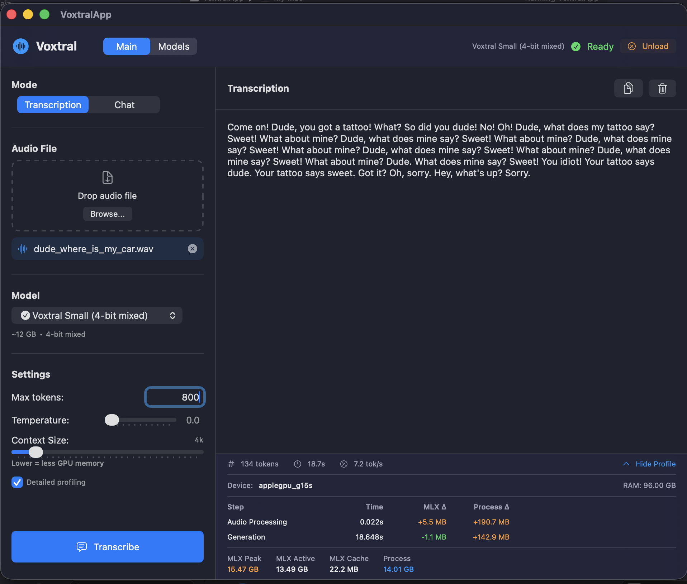
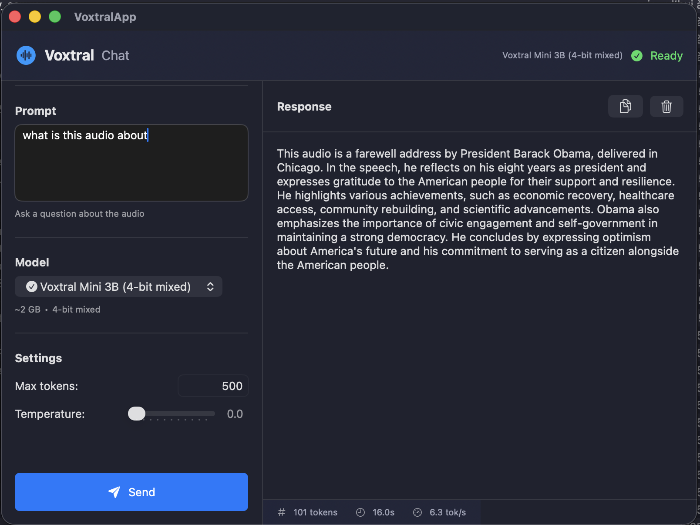

# MLX Voxtral Swift

A native Swift implementation of [Voxtral](https://huggingface.co/mistralai/Voxtral-mini-3B-2507) speech-to-text model, running on Apple Silicon with [MLX](https://github.com/ml-explore/mlx-swift).

This is a Swift port of the excellent Python implementation by [@mzbac](https://github.com/mzbac): **[mlx.voxtral](https://github.com/mzbac/mlx.voxtral)**

## Screenshots

| Transcription Mode | Chat Mode |
|:--:|:--:|
|  |  |

## Features

- **Native Swift** - Pure Swift implementation, no Python dependencies at runtime
- **MLX Acceleration** - Leverages Apple's MLX framework for optimal Apple Silicon performance
- **Quantized Models** - Supports 4-bit and 8-bit quantized models for reduced memory usage
- **Streaming Output** - Real-time token-by-token transcription
- **SwiftUI App** - Ready-to-use macOS application with drag-and-drop interface
- **Library Integration** - Import `VoxtralCore` into your own Swift projects
- **Chat Mode** - Ask questions about audio content (like the Python `voxtral_chat.py`)

## Requirements

- macOS 14.0 (Sonoma) or later
- Apple Silicon Mac (M1/M2/M3/M4)
- Xcode 15.0 or later
- Swift 5.9 or later

## Installation

### Swift Package Manager

Add to your `Package.swift`:

```swift
dependencies: [
    .package(url: "https://github.com/VincentGourbin/mlx-voxtral-swift", branch: "main")
]
```

Then add `VoxtralCore` to your target dependencies:

```swift
.target(
    name: "YourApp",
    dependencies: [
        .product(name: "VoxtralCore", package: "mlx-voxtral-swift")
    ]
)
```

### Clone and Build

```bash
git clone https://github.com/VincentGourbin/mlx-voxtral-swift.git
cd mlx-voxtral-swift
swift build
```

## Available Models

### Mini 3B (Fast, lightweight)

| Model ID | HuggingFace Repo | Disk | GPU Peak | Speed |
|----------|------------------|------|----------|-------|
| `mini-3b` | `mistralai/Voxtral-Mini-3B-2507` | ~6 GB | ~15 GB | 5.6 tok/s |
| `mini-3b-8bit` | `mzbac/voxtral-mini-3b-8bit` | ~3.5 GB | ~10 GB | **14.5 tok/s** |
| `mini-3b-4bit` | `mzbac/voxtral-mini-3b-4bit-mixed` | ~2 GB | ~8 GB | **17.7 tok/s** |

### Small 24B (High quality, resource intensive)

| Model ID | HuggingFace Repo | Disk | GPU Peak | Speed |
|----------|------------------|------|----------|-------|
| `small-24b` | `mistralai/Voxtral-Small-24B-2507` | ~48 GB | ~56 GB | 0.5 tok/s |
| `small-24b-8bit` | `VincentGOURBIN/voxtral-small-8bit` | ~25 GB | ~31 GB | 0.7 tok/s |
| `small-4bit` | `VincentGOURBIN/voxtral-small-4bit-mixed` | ~12 GB | ~21 GB | **1.0 tok/s** |

> **Recommended**: `mini-3b-8bit` for most users (best speed/quality balance)

## Model Download

The CLI can automatically download models from HuggingFace:

```bash
# List available models
./.build/debug/VoxtralCLI list

# Download the recommended model
./.build/debug/VoxtralCLI download mini-3b-8bit

# Download by HuggingFace repo ID
./.build/debug/VoxtralCLI download mzbac/voxtral-mini-3b-8bit
```

Or use `huggingface-cli` directly:

```bash
huggingface-cli download mzbac/voxtral-mini-3b-8bit
```

## Usage

### SwiftUI Application

Build and run the macOS app:

```bash
swift build --product VoxtralApp
./create_app_bundle.sh
open Voxtral.app
```

The app provides:
- Drag-and-drop audio file selection
- Transcription and Chat modes
- Real-time streaming output
- Configurable max tokens and temperature

### Command Line Interface

Build and use the CLI:

```bash
swift build --product VoxtralCLI

# List available models
./.build/debug/VoxtralCLI list

# Download a model
./.build/debug/VoxtralCLI download mini-3b-8bit

# Transcribe audio
./.build/debug/VoxtralCLI transcribe /path/to/audio.mp3 --model mini-3b-8bit

# Chat mode - ask questions about audio
./.build/debug/VoxtralCLI chat /path/to/audio.mp3 "What language is being spoken?"

# Get help
./.build/debug/VoxtralCLI --help
```

### Library Integration

```swift
import VoxtralCore
import MLX

// Load model
let (model, config) = try loadVoxtralStandardModel(
    modelPath: "/path/to/voxtral-mini-3b-8bit",
    dtype: .float16
)

// Create wrapper and processor
let voxtral = VoxtralForConditionalGeneration(standardModel: model)
let processor = try VoxtralProcessor.fromPretrained("/path/to/voxtral-mini-3b-8bit")

// Transcribe audio
let inputs = try processor.applyTranscritionRequest(
    audio: "/path/to/audio.mp3",
    language: "en",
    samplingRate: 16000
)

// Generate with streaming
let results = try voxtral.generateStream(
    inputIds: inputs.inputIds,
    inputFeatures: inputs.inputFeatures,
    attentionMask: nil,
    maxNewTokens: 500,
    temperature: 0.0,
    topP: 1.0,
    repetitionPenalty: 1.1
)

// Process tokens as they arrive
var transcription = ""
for (token, _) in results {
    let tokenId = token.item(Int.self)
    if let text = try? processor.decode([tokenId]) {
        transcription += text
        print(text, terminator: "")
    }
}
```

### Chat Mode (Ask Questions About Audio)

```swift
// Build conversation with audio and text prompt
let conversation: [[String: Any]] = [
    [
        "role": "user",
        "content": [
            ["type": "audio", "audio": "/path/to/audio.mp3"],
            ["type": "text", "text": "What language is being spoken?"]
        ]
    ]
]

let chatResult = try processor.applyChatTemplate(
    conversation: conversation,
    tokenize: true,
    returnTensors: "mlx"
) as! [String: MLXArray]

let inputs = ProcessedInputs(
    inputIds: chatResult["input_ids"]!,
    inputFeatures: chatResult["input_features"]!
)

// Generate response...
```

## Architecture

```
mlx-voxtral-swift/
├── Sources/
│   ├── VoxtralCore/           # Core library
│   │   ├── VoxtralModeling.swift      # Main model architecture
│   │   ├── VoxtralProcessor.swift     # Audio & text processing
│   │   ├── VoxtralFeatureExtractor.swift  # Mel-spectrogram extraction
│   │   ├── VoxtralComponents.swift    # Tokenizer, encoder components
│   │   ├── VoxtralConfiguration.swift # Model config parsing
│   │   ├── Models/                    # LLM model definitions
│   │   └── Utils/                     # Loading & utility functions
│   ├── VoxtralApp/            # SwiftUI macOS application
│   │   ├── VoxtralAppMain.swift
│   │   ├── ContentView.swift
│   │   └── TranscriptionManager.swift
│   └── VoxtralTranscriptionTest/  # CLI example
└── Tests/
    └── VoxtralCoreTests/      # Unit tests
```

## Key Components

| Component | Description |
|-----------|-------------|
| `VoxtralForConditionalGeneration` | Main model class combining audio encoder and language model |
| `VoxtralProcessor` | Handles audio loading, mel-spectrogram, and tokenization |
| `VoxtralEncoder` | Whisper-style audio encoder (conv layers + transformer) |
| `MultiModalProjector` | Projects audio embeddings to LLM hidden dimension |
| `TekkenTokenizer` | Mistral's tiktoken-based tokenizer |

## Supported Audio Formats

- MP3
- WAV
- M4A
- FLAC
- And any format supported by AVFoundation

## Performance Benchmarks

> Tested on **Apple M3 Max with 96GB unified memory**, Hybrid mode (Core ML encoder + MLX decoder)

### Mini 3B - Transcription Mode (500 tokens, ~8.5 min audio)

| Quantization | Time | Tokens/s | RTF | GPU Active | GPU Peak |
|--------------|------|----------|-----|------------|----------|
| **fp16** | 90.1s | 5.6 | 5.7x | 7.50 GB | 15.26 GB |
| **8-bit** | 34.6s | 14.5 | 14.8x | 4.00 GB | 10.05 GB |
| **4-bit mixed** | 28.2s | **17.7** | **18.1x** | 2.28 GB | 8.31 GB |

### Mini 3B - Analysis Mode (Chat)

| Quantization | Tokens | Time | Tokens/s | GPU Active | GPU Peak |
|--------------|--------|------|----------|------------|----------|
| **fp16** | 64 | 28.8s | 2.2 | 7.50 GB | 15.27 GB |
| **8-bit** | 77 | 21.6s | 3.6 | 4.00 GB | 10.07 GB |
| **4-bit mixed** | 68 | 20.1s | 3.4 | 2.28 GB | 8.33 GB |

### Small 24B - Analysis Mode (Chat)

| Quantization | Tokens | Time | Tokens/s | GPU Active | GPU Peak |
|--------------|--------|------|----------|------------|----------|
| **fp16** | 63 | 116.0s | 0.54 | 43.93 GB | 55.56 GB |
| **8-bit** | 53 | 71.6s | 0.74 | 23.35 GB | 30.96 GB |
| **4-bit mixed** | 70 | 70.2s | **1.00** | 12.98 GB | 20.55 GB |

### Model Recommendations

| Model | Best For | Min Memory | Speed |
|-------|----------|------------|-------|
| **Mini 4-bit** | Mac 8-16GB | ~8 GB | Fast |
| **Mini 8-bit** | Mac 16-32GB | ~10 GB | Balanced |
| **Mini fp16** | Mac 32GB+ | ~15 GB | Best quality |
| **Small 4-bit** | Mac 32GB+ | ~21 GB | High quality |
| **Small 8-bit** | Mac 64GB+ | ~31 GB | Very high quality |
| **Small fp16** | Mac 128GB+ | ~56 GB | Maximum quality |

### Swift vs Python Comparison

| Implementation | Time | Speedup | Peak Memory |
|----------------|------|---------|-------------|
| **Python** (mlx-voxtral) | 131s | baseline | - |
| **Swift MLX** | 85.6s | **1.53x faster** | 10.79 GB |
| **Swift Hybrid** | 81.9s | **1.60x faster** | 10.20 GB |

### Profiling Mode

Run with `--profile` flag for detailed metrics (TTFT, memory):

```bash
VoxtralCLI transcribe audio.mp3 --backend hybrid --profile
```

## Hybrid Mode (Core ML + MLX)

The hybrid mode uses Apple's Core ML for the audio encoder (running on GPU or ANE) while keeping the LLM decoder on MLX. This provides:

- **Faster encoding** for long audio files
- **Lower memory usage** (~660 MB less)
- **Better thermal performance** for sustained workloads

### Enabling Hybrid Mode

**CLI:**
```bash
# Use --backend hybrid flag
./.build/debug/VoxtralCLI transcribe --backend hybrid /path/to/audio.mp3
```

**App:**
Enable "Hybrid mode (Core ML + MLX)" toggle in Settings.

### Building the Core ML Encoder

The Core ML model (~1.2 GB) is not included in the repository. Generate it with:

```bash
cd Scripts/CoreMLConversion
chmod +x convert.sh
./convert.sh
```

This script will:
1. Create a Python virtual environment
2. Download the Voxtral model from HuggingFace
3. Extract encoder weights
4. Convert to Core ML format
5. Compile to `.mlmodelc`

Then copy the output to the app:

```bash
cp -r Scripts/CoreMLConversion/output/VoxtralEncoderFull.mlmodelc Sources/VoxtralApp/Resources/
swift build
```

**Requirements:**
- Python 3.10+
- ~10 GB disk space
- macOS 13.0+ (for Core ML compilation)

## Acknowledgments

This project is a Swift port of the Python implementation:

- **[mlx.voxtral](https://github.com/mzbac/mlx.voxtral)** by [@mzbac](https://github.com/mzbac) - The original MLX Python implementation that made this port possible. Thank you for the excellent reference implementation!

Built with:
- [MLX Swift](https://github.com/ml-explore/mlx-swift) - Apple's machine learning framework
- [Swift Transformers](https://github.com/huggingface/swift-transformers) - HuggingFace tokenizers
- [MLX Swift Examples](https://github.com/ml-explore/mlx-swift-examples) - LLM implementations

## License

MIT License - See [LICENSE](LICENSE) file.

## Contributing

Contributions are welcome! Please feel free to submit issues and pull requests.

## Related Projects

- [Voxtral (HuggingFace)](https://huggingface.co/mistralai/Voxtral-mini-3B-2507) - Original Mistral model
- [mlx.voxtral (Python)](https://github.com/mzbac/mlx.voxtral) - Python MLX implementation
- [MLX Swift](https://github.com/ml-explore/mlx-swift) - Apple's ML framework for Swift
