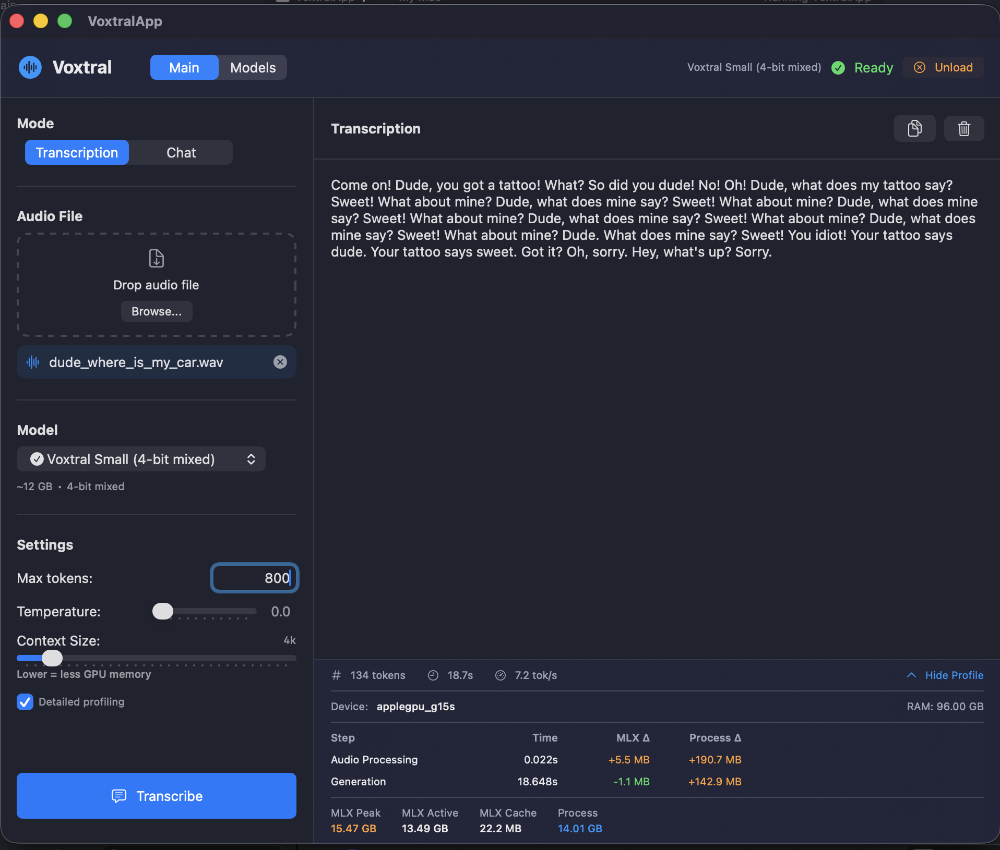
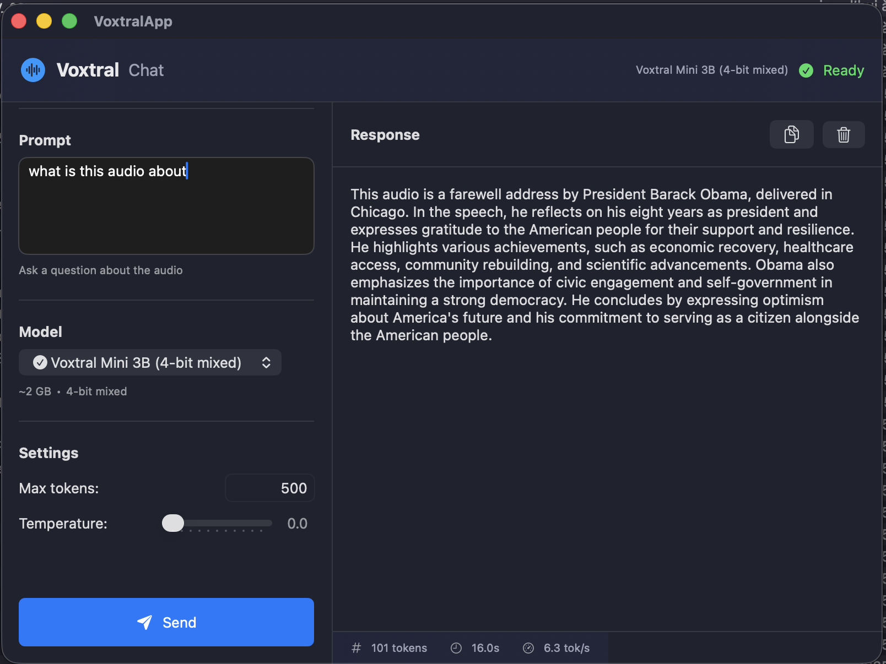

# MLX Voxtral Swift

A native Swift implementation of [Voxtral](https://huggingface.co/mistralai/Voxtral-mini-3B-2507) speech-to-text and [Voxtral TTS](https://huggingface.co/mistralai/Voxtral-4B-TTS-2603) text-to-speech models, running on Apple Silicon with [MLX](https://github.com/ml-explore/mlx-swift).

[](https://apps.apple.com/us/app/fluxforge-studio/id6758351212) [](https://fluxforge.vinceforge.com)

This is a Swift port of the excellent Python implementation by [@mzbac](https://github.com/mzbac): **[mlx.voxtral](https://github.com/mzbac/mlx.voxtral)**

## Screenshots

| Transcription Mode | Chat Mode |
|:--:|:--:|
|  |  |

## Features

- **Native Swift** - Pure Swift implementation, no Python dependencies at runtime
- **MLX Acceleration** - Leverages Apple's MLX framework for optimal Apple Silicon performance
- **Speech-to-Text** - Transcribe audio with Mini 3B and Small 24B models (4-bit, 8-bit, fp16)
- **Text-to-Speech** - Generate natural speech with Voxtral TTS 4B in 9 languages, 20 voice presets
- **Quantized TTS** - 4-bit and 6-bit TTS models for fast on-device generation (up to 19 fps)
- **Streaming TTS** - Real-time audio playback with TTFT measurement for conversational use
- **Prosody-aware sanitization** - Automatic text preprocessing for natural speech with proper pauses
- **SwiftUI App** - Ready-to-use macOS application with drag-and-drop interface
- **Streaming demo** - SwiftUI app for benchmarking TTS streaming with live metrics
- **Library Integration** - Import `VoxtralCore` into your own Swift projects
- **Chat Mode** - Ask questions about audio content

## Requirements

- macOS 14.0 (Sonoma) or later
- Apple Silicon Mac (M1/M2/M3/M4)
- Xcode 15.0 or later
- Swift 6.0 or later

## Installation

### Swift Package Manager

Add to your `Package.swift`:

```swift
dependencies: [
    .package(url: "https://github.com/VincentGourbin/mlx-voxtral-swift", branch: "main")
]
```

Then add `VoxtralCore` to your target dependencies:

```swift
.target(
    name: "YourApp",
    dependencies: [
        .product(name: "VoxtralCore", package: "mlx-voxtral-swift")
    ]
)
```

### Clone and Build

```bash
git clone https://github.com/VincentGourbin/mlx-voxtral-swift.git
cd mlx-voxtral-swift
xcodebuild -scheme VoxtralCLI -configuration Release \
  -derivedDataPath .build/xcode -destination 'platform=macOS' build
```

## Text-to-Speech (TTS)

Voxtral TTS 4B generates natural, expressive speech from text. It supports **9 languages** (English, French, German, Spanish, Dutch, Portuguese, Italian, Hindi, Arabic) and comes with **20 voice presets**.

### TTS Models

| Model ID | Size | Quantization | Speed | Recommended for |
|----------|------|-------------|-------|-----------------|
| `tts-4b-4bit` | ~2.5 GB | 4-bit | **19 fps** | English, short French |
| `tts-4b-6bit` | ~3.5 GB | 6-bit | **13 fps** | French, all languages |
| `tts-4b-mlx` | ~8 GB | bf16 | 2.5 fps | Quality baseline |

### TTS Benchmark (M3 Max 96GB)

Tested with Fluxforge app description text (short: 1 sentence, long: ~350 words).

| Text | Model | Voice | TTFT | Audio | RTF |
|------|-------|-------|------|-------|-----|
| Short FR | **4-bit** | fr_female | **224ms** | 4.16s | **0.85x** |
| Short EN | **4-bit** | neutral_male | 400ms | 5.68s | 1.17x |
| Long EN | **4-bit** | neutral_male | 909ms | 181s | **0.67x** |
| Long FR | **6-bit** | fr_female | 1132ms | 174s | **1.12x** |

> RTF < 1.0 means audio is generated faster than it can be played back. Full benchmark with audio samples: [`docs/tts_benchmark.md`](docs/tts_benchmark.md)

### TTS CLI Usage

```bash
# Download a TTS model
.build/xcode/Build/Products/Release/VoxtralCLI download tts-4b-6bit

# Basic text-to-speech
.build/xcode/Build/Products/Release/VoxtralCLI tts "Hello, this is a test." -o output.wav

# Choose model and voice
.build/xcode/Build/Products/Release/VoxtralCLI tts "Bonjour le monde!" \
  -o bonjour.wav --voice fr_female --model tts-4b-6bit

# Disable sanitization for raw text control
.build/xcode/Build/Products/Release/VoxtralCLI tts "YOUR TEXT" \
  -o output.wav --no-sanitize
```

### TTS Library Integration

```swift
import VoxtralCore

let pipeline = VoxtralTTSPipeline()

// Load model (downloads automatically from HuggingFace)
try await pipeline.loadModel(modelInfo: VoxtralTTSRegistry.model(withId: "tts-4b-6bit")!)

// Synthesize speech
let result = try await pipeline.synthesize(text: "Hello world!", voice: .neutralFemale)
print("Generated \(result.duration)s of audio in \(result.generationTime)s (TTFT: \(result.timeToFirstToken)s)")

// Save to WAV file
try WAVWriter.write(waveform: result.waveform, to: outputURL)

pipeline.unload()
```

### Streaming TTS

```swift
let stream = pipeline.synthesizeStreaming(text: "Long text here...", voice: .frFemale, chunkSize: 10)

for try await chunk in stream {
    if chunk.isFirst {
        print("TTFT: \(chunk.elapsed * 1000)ms")
    }
    // Schedule chunk.waveform on AVAudioPlayerNode for real-time playback
}
```

### Available Voices

| Language | Voices |
|----------|--------|
| English | `casual_female`, `casual_male`, `cheerful_female`, `neutral_female`, `neutral_male` |
| French | `fr_male`, `fr_female` |
| German | `de_male`, `de_female` |
| Spanish | `es_male`, `es_female` |
| Italian | `it_male`, `it_female` |
| Portuguese | `pt_male`, `pt_female` |
| Dutch | `nl_male`, `nl_female` |
| Arabic | `ar_male` |
| Hindi | `hi_male`, `hi_female` |

## Speech-to-Text (STT)

### Available STT Models

#### Mini 3B (Fast, lightweight)

| Model ID | HuggingFace Repo | Disk | GPU Peak | Speed |
|----------|------------------|------|----------|-------|
| `mini-3b` | `mistralai/Voxtral-Mini-3B-2507` | ~6 GB | ~15 GB | 5.6 tok/s |
| `mini-3b-8bit` | `mzbac/voxtral-mini-3b-8bit` | ~3.5 GB | ~10 GB | **14.5 tok/s** |
| `mini-3b-4bit` | `mzbac/voxtral-mini-3b-4bit-mixed` | ~2 GB | ~8 GB | **17.7 tok/s** |

#### Small 24B (High quality, resource intensive)

| Model ID | HuggingFace Repo | Disk | GPU Peak | Speed |
|----------|------------------|------|----------|-------|
| `small-24b` | `mistralai/Voxtral-Small-24B-2507` | ~48 GB | ~56 GB | 0.5 tok/s |
| `small-24b-8bit` | `VincentGOURBIN/voxtral-small-8bit` | ~25 GB | ~31 GB | 0.7 tok/s |
| `small-4bit` | `VincentGOURBIN/voxtral-small-4bit-mixed` | ~12 GB | ~21 GB | **1.0 tok/s** |

> **Recommended**: `mini-3b-8bit` for most users (best speed/quality balance)

### STT CLI Usage

```bash
# Download the recommended model
.build/xcode/Build/Products/Release/VoxtralCLI download mini-3b-8bit

# Transcribe audio
.build/xcode/Build/Products/Release/VoxtralCLI transcribe /path/to/audio.mp3 --model mini-3b-8bit

# Chat mode - ask questions about audio
.build/xcode/Build/Products/Release/VoxtralCLI chat /path/to/audio.mp3 "What language is being spoken?"
```

### STT Library Integration

```swift
import VoxtralCore

let pipeline = VoxtralPipeline(
    model: .mini3b8bit,
    backend: .auto
)

try await pipeline.loadModel()
let text = try await pipeline.transcribe(audio: audioURL, language: "en")
print(text)
pipeline.unload()
```

### STT Benchmark (M3 Max 96GB)

| Quantization | Time | Tokens/s | GPU Peak |
|--------------|------|----------|----------|
| **fp16** | 90.1s | 5.6 | 15.26 GB |
| **8-bit** | 34.6s | 14.5 | 10.05 GB |
| **4-bit mixed** | 28.2s | **17.7** | 8.31 GB |

## Hybrid Mode (Core ML + MLX)

The hybrid mode uses Apple's Core ML for the audio encoder while keeping the LLM decoder on MLX:

- **Faster encoding** for long audio files
- **Lower memory usage** (~660 MB less)

```bash
# Auto mode (recommended): uses Core ML if available
.build/xcode/Build/Products/Release/VoxtralCLI transcribe /path/to/audio.mp3 --backend hybrid
```

## Architecture

```
mlx-voxtral-swift/
├── Sources/
│   ├── VoxtralCore/           # Core library (STT + TTS)
│   │   ├── TTS/               # Text-to-Speech module
│   │   │   ├── Pipeline/      # High-level TTS API + streaming
│   │   │   ├── VoxtralTTSModeling.swift    # TTS model + text sanitization
│   │   │   ├── VoxtralCodecDecoder.swift   # Audio codec (24kHz)
│   │   │   └── VoxtralFlowMatching.swift   # Flow matching transformer
│   │   ├── Models/            # LLM definitions
│   │   └── Utils/             # Loading & utilities
│   ├── VoxtralApp/            # SwiftUI macOS application
│   ├── VoxtralTranscriptionTest/  # CLI (STT + TTS commands)
│   └── VoxtralTTSStreamingDemo/   # Streaming TTS benchmark app
├── docs/
│   ├── tts_benchmark.md       # Full TTS benchmark results
│   └── examples/              # Generated audio samples (WAV)
└── Tests/
```

## Acknowledgments

This project is a Swift port of the Python implementation:

- **[mlx.voxtral](https://github.com/mzbac/mlx.voxtral)** by [@mzbac](https://github.com/mzbac) - The original MLX Python implementation

Built with:
- [MLX Swift](https://github.com/ml-explore/mlx-swift) - Apple's machine learning framework
- [Swift Transformers](https://github.com/huggingface/swift-transformers) - HuggingFace tokenizers
- [MLX Swift LM](https://github.com/ml-explore/mlx-swift-lm) - LLM implementations

## License

MIT License - See [LICENSE](LICENSE) file.

## Contributing

Contributions are welcome! Please feel free to submit issues and pull requests.
