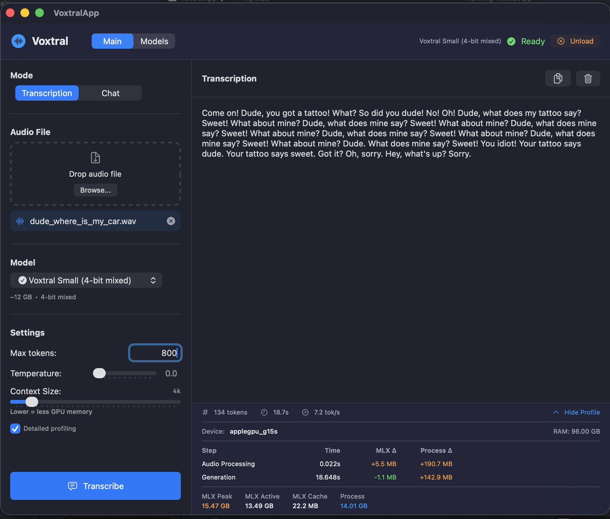
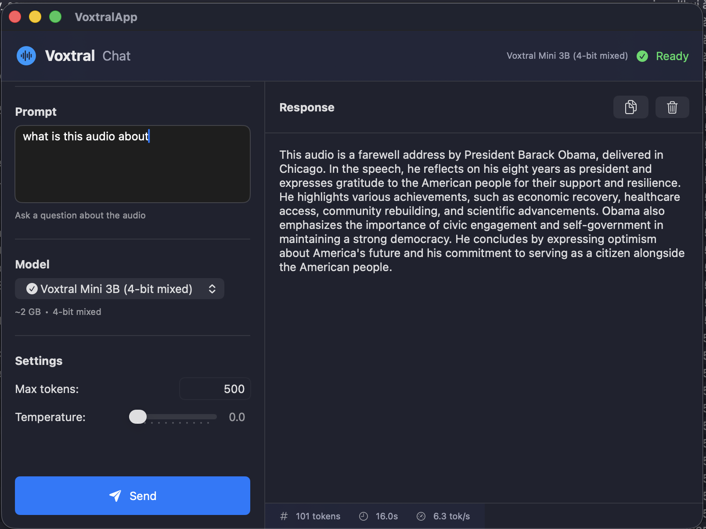
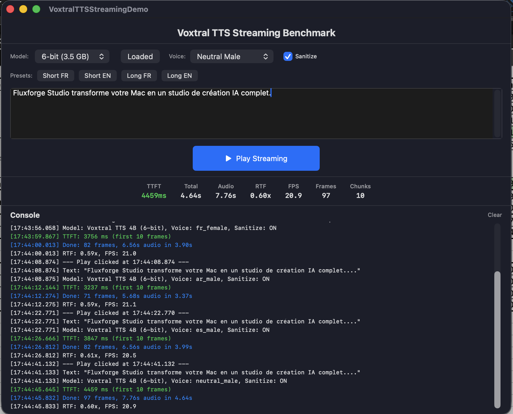

# MLX Voxtral Swift

A native Swift implementation of [Voxtral](https://huggingface.co/mistralai/Voxtral-mini-3B-2507) speech-to-text (Mini 3B, Small 24B, and the streaming model [Voxtral Mini 4B Realtime](https://huggingface.co/mistralai/Voxtral-Mini-4B-Realtime-2602)) and [Voxtral TTS](https://huggingface.co/mistralai/Voxtral-4B-TTS-2603) text-to-speech with voice cloning, running on Apple Silicon with [MLX](https://github.com/ml-explore/mlx-swift).

[](https://apps.apple.com/us/app/fluxforge-studio/id6758351212) [](https://fluxforge.vinceforge.com)

This is a Swift port of the excellent Python implementation by [@mzbac](https://github.com/mzbac): **[mlx.voxtral](https://github.com/mzbac/mlx.voxtral)**

## Screenshots

| Transcription Mode | Chat Mode |
|:--:|:--:|
|  |  |

| TTS Streaming & Voice Cloning Demo |
|:--:|
|  |

The streaming demo app also does end-to-end **voice cloning** — enroll a
voice from an audio file, a video extract, or a mic recording, then speak
with it. See the [app guide](docs/streaming_demo.md).

## Features

- **Native Swift** - Pure Swift implementation, no Python dependencies at runtime
- **MLX Acceleration** - Leverages Apple's MLX framework on Apple Silicon
- **Speech-to-Text** - Transcribe audio with Mini 3B and Small 24B models (4-bit, 8-bit, 16-bit) — `VoxtralPipeline`
- **Realtime Speech-to-Text** - Voxtral Mini 4B Realtime (4-bit, fp16) — `VoxtralRealtimePipeline`, `VoxtralCLI realtime`; it transcribes an audio file, there is no live-input streaming API yet (audit P-71)
- **Text-to-Speech** - Generate natural speech with Voxtral TTS 4B in 9 languages, 20 voice presets — `VoxtralTTSPipeline`
- **Voice Cloning** - Clone a voice from ~16s of reference audio (file, video extract, or mic), natively in Swift ([guide](docs/voice_cloning.md))
- **Quantized TTS** - 4-bit and 6-bit TTS models (up to 18.8 frames/s in the April 2026 benchmark, in session — see [TTS Models](#tts-models))
- **Streaming TTS** - Chunked audio API for playback (see the v2.2.2 limitation under [Streaming TTS](#streaming-tts))
- **Prosody-aware sanitization** - Automatic text preprocessing for natural speech with proper pauses
- **SwiftUI App** - Ready-to-use macOS application with drag-and-drop interface
- **Streaming demo** - SwiftUI app for TTS streaming with live metrics and voice cloning
- **Library Integration** - Import `VoxtralCore` into your own Swift projects
- **Chat Mode** - Ask questions about audio content

## Requirements

- macOS 15.0 or later, or iOS 17.0 or later (`Package.swift:10-13`; iOS is declared and compiles, but has never been run on a device — audit FA-09)
- Apple Silicon Mac (M1/M2/M3/M4)
- Xcode 26 or later (Swift 6.2 toolchain: `swift-tools-version: 6.2`, `Package.swift:1`)

## Installation

### Swift Package Manager

Add to your `Package.swift`:

```swift
dependencies: [
    // v2.2.2 pinned by revision — see "Depending on v2.2.x" below
    .package(url: "https://github.com/VincentGourbin/mlx-voxtral-swift", revision: "9392ed13c9be8d2e9bc1752cd57817d318f2eb40")
    // or follow the latest commit: branch: "main"
]
```

Then add `VoxtralCore` to your target dependencies:

```swift
.target(
    name: "YourApp",
    dependencies: [
        .product(name: "VoxtralCore", package: "mlx-voxtral-swift")
    ]
)
```

### Depending on v2.2.x

The current release line is **v2.2.x**; the latest tag, `v2.2.2`, is commit `9392ed1` (audit FV-01).

- Since v2.2.2 this package depends on `mlx-swift-lm` by `branch: "main"` (`Package.swift:52`; the reason is in
  the comment at `Package.swift:46-51`). SwiftPM does not let a package required **by version** depend on a
  branch, so a requirement such as `from: "2.2.0"` cannot resolve to v2.2.2 (audit FA-02; the exact resolver
  output on a consumer project has not been recorded yet).
- Until `mlx-swift-lm` publishes a tag beyond `3.31.4` (its latest tag on 2026-09-27, audit FV-02), depend on
  `revision: "9392ed13c9be8d2e9bc1752cd57817d318f2eb40"` (v2.2.2) or `branch: "main"`.
- If your own package also depends on `mlx-swift-lm`, it must use `branch: "main"` as well: SwiftPM cannot resolve a
  version requirement and a branch requirement on the same package (`Package.swift:46-50`).
- The git tag is the version. `VoxtralCoreVersion` (`"0.1.0"`, `Sources/VoxtralCore/VoxtralCore.swift:45`) and
  `VoxtralCLI --version` (`2.0.0`, `Sources/VoxtralTranscriptionTest/VoxtralCLI.swift:25`) do not follow the
  release tags (audit S-20).

### Clone and Build

```bash
git clone https://github.com/VincentGourbin/mlx-voxtral-swift.git
cd mlx-voxtral-swift
xcodebuild -scheme VoxtralCLI -configuration Release \
  -derivedDataPath .build/xcode -destination 'platform=macOS' build

# Package the macOS app (Release, with its resource bundles) as .build/Voxtral.app
Scripts/package-app.sh
```

The app downloads the Core ML encoder the first time the hybrid backend is used; nothing large is bundled.

The executable is `.build/xcode/Build/Products/Release/VoxtralCLI`; its help text calls it `voxtral`, which is
only the command name (`VoxtralCLI.swift:23`), not an installed binary.

## Text-to-Speech (TTS)

Voxtral TTS 4B generates natural, expressive speech from text. It supports **9 languages** (English, French, German, Spanish, Dutch, Portuguese, Italian, Hindi, Arabic) and comes with **20 voice presets**.

### TTS Models

| Model ID | Download (GB)¹ | Quantization | Speed (frames/s)² | Recommended for |
|----------|------|-------------|-------|-----------------|
| `tts-4b-4bit` | 2.51 | 4-bit | **18.8** | English, short French |
| `tts-4b-6bit` | 3.47 | 6-bit | **13.5** | French, all languages |
| `tts-4b-mlx` (default) | 8.00 | bf16 | 2.6 | Quality baseline |
| `tts-4b` | 8.00 | bf16 (original Mistral checkpoint) | — | Voice cloning examples |

¹ Exact bytes of the weight files on the Hub on 2026-09-27, 1 GB = 10⁹ bytes — [docs/Weights.md](docs/Weights.md).
The sizes declared in the registry (`VoxtralTTSRegistry.swift:34`, `:44`, `:53`, `:62`) are approximate (audit M-03, fiche K-24).

² **Definition**: code frames generated ÷ generation time (1 frame = 80 ms of audio), long EN text, voice
`neutral_male`, M3 Max 96 GB: 2 266 / 120.61 s, 2 101 / 155.46 s, 2 314 / 902.26 s (rows of
[docs/tts_benchmark.md](docs/tts_benchmark.md)). **Revision**: published in `6ad4e56` (2026-04-02); the code
revision measured was not recorded; it predates `a00024f`, `0be05af` and `f4fd21c` (audit FV-30). **In session**:
not measured under the A/B/B/A protocol, not a reference ([docs/Benchmarks.md](docs/Benchmarks.md) §6); re-measured
by fiche K-35.

The library, registry and CLI default is `tts-4b-mlx` (bf16), the slowest pack (`VoxtralTTSRegistry.swift:29-37`,
`VoxtralCLI.swift:400`); the default is to be settled by measurement (audit FA-03, fiche K-79).

### TTS Benchmark (M3 Max 96GB, April 2026, in session)

Tested with the Fluxforge app description text (short: 1 sentence; long: 163 words EN / 202 words FR as printed in
[docs/tts_benchmark.md](docs/tts_benchmark.md), announced there as "~350 words" — [PLAN.md](docs/audit/2026-09-27/PLAN.md) §1).

| Text | Model | Voice | TTFT | Audio | RTF |
|------|-------|-------|------|-------|-----|
| Short FR | **4-bit** | fr_female | **224ms** | 4.16s | **0.85x** |
| Short EN | **4-bit** | neutral_male | 400ms | 5.68s | 1.17x |
| Long EN | **4-bit** | neutral_male | 909ms | 181s | **0.67x** |
| Long FR | **6-bit** | fr_female | 1132ms | 174s | **1.12x** |

> **Definitions.** TTFT = time from the start of `generate` (tokenization and prefill included) to the first
> evaluated code frame (`VoxtralTTSModeling.swift:441`, `:496-499`): it is not the first audio sample. At v2.2.2 it
> excludes the prefill of the voice frames only when that prefix comes from the per-voice cache (preset voices, and
> streaming with a `voiceKey`: `VoxtralTTSPipeline.swift:210`, `:512`); that cache arrived in `f4fd21c`
> (2026-07-10), so the TTFT values below, measured before it, include the voice prefill. RTF = generation time ÷
> audio duration, **< 1.0 = faster than real time**
> (`TTSSynthesisResult.realTimeFactor`, `VoxtralTTSProcessor.swift:30-33`); `VoxtralCLI profile` prints the inverse
> as "RT factor" (`ProfileCommand.swift:274`). Glossary: [docs/Benchmarks.md](docs/Benchmarks.md) §4.
> **Revision**: published in `1bb54bf` and `6ad4e56` (2026-04-02), code revision not recorded, before `a00024f`,
> `0be05af`, `f4fd21c`. **In session**: not a reference (audit FV-30); re-measured by fiche K-35. Full table with
> audio samples: [`docs/tts_benchmark.md`](docs/tts_benchmark.md)

### TTS CLI Usage

```bash
# Download a TTS model
.build/xcode/Build/Products/Release/VoxtralCLI download tts-4b-6bit

# Basic text-to-speech
.build/xcode/Build/Products/Release/VoxtralCLI tts "Hello, this is a test." -o output.wav

# Choose model and voice
.build/xcode/Build/Products/Release/VoxtralCLI tts "Bonjour le monde!" \
  -o bonjour.wav --voice fr_female --model tts-4b-6bit

# Disable sanitization for raw text control
.build/xcode/Build/Products/Release/VoxtralCLI tts "YOUR TEXT" \
  -o output.wav --no-sanitize
```

> **Settings with no effect at v2.2.2.** `--flow-steps`, `--cfg-alpha` and `-t/--temperature` are accepted but not
> used: the flow-matching step count (8) and CFG alpha (1.2) are hard-coded (`VoxtralFlowMatching.swift:195-196`),
> and `VoxtralTTSPipeline.Configuration.flowSteps`, `.cfgAlpha` and `.temperature` are read nowhere in the TTS path
> (audit P-35; wiring and sweep: fiche K-48).

### TTS Library Integration

```swift
import VoxtralCore

let pipeline = VoxtralTTSPipeline()

// Load model (downloads automatically from HuggingFace)
try await pipeline.loadModel(modelInfo: VoxtralTTSRegistry.model(withId: "tts-4b-6bit")!)

// Synthesize speech
let result = try await pipeline.synthesize(text: "Hello world!", voice: .neutralFemale)
print("Generated \(result.duration)s of audio in \(result.generationTime)s (TTFT: \(result.timeToFirstToken)s)")

// Save to WAV file
try WAVWriter.write(waveform: result.waveform, to: outputURL)

pipeline.unload()
```

`result.timeToFirstToken` is the TTFT defined under the benchmark table (first code frame, not first audio).

### Streaming TTS

```swift
let stream = pipeline.synthesizeStreaming(text: "Long text here...", voice: .frFemale, chunkSize: 10)

for try await chunk in stream {
    if chunk.isFirst {
        print("First chunk after \(chunk.elapsed * 1000)ms")
    }
    // Schedule chunk.waveform on AVAudioPlayerNode for real-time playback
}
```

> **v2.2.2 limitation.** The model generates every frame inside the stream's synchronous build closure
> (`VoxtralTTSModeling.swift:572-688`), so the first chunk is delivered only after the whole utterance has been
> generated: the first chunk's `elapsed` is close to the total generation time, not a time to first audio (audit
> S-08, FA-04; fixed by fiche K-12).

### Available Voices

| Language | Voices |
|----------|--------|
| English | `casual_female`, `casual_male`, `cheerful_female`, `neutral_female`, `neutral_male` |
| French | `fr_male`, `fr_female` |
| German | `de_male`, `de_female` |
| Spanish | `es_male`, `es_female` |
| Italian | `it_male`, `it_female` |
| Portuguese | `pt_male`, `pt_female` |
| Dutch | `nl_male`, `nl_female` |
| Arabic | `ar_male` |
| Hindi | `hi_male`, `hi_female` |

### Voice Cloning

Beyond the 20 built-in presets, you can **clone a voice** from a short
reference recording — entirely in Swift, no Python at runtime. Enroll a
voice once (offline), then reuse it like any preset.

```bash
# 1. Enroll a voice from ~16s of clean single-speaker audio (offline, one time)
.build/xcode/Build/Products/Release/VoxtralCLI enroll my_voice.wav \
  -o my_voice.safetensors --model tts-4b --duration 16

# 2. Make that cloned voice say anything
.build/xcode/Build/Products/Release/VoxtralCLI tts "Hello, this is my cloned voice." \
  -o hello.wav --model tts-4b --voice-embedding my_voice.safetensors
```

Reference guidance: aim for **10–16 s** of clean speech, one speaker, no
background music. Any format (wav/mp3/m4a) works. Before optimization the
reference is prepared in this order (`VoxtralVoiceEnrollment.swift:151-162`):

1. a **70 Hz high-pass** (zero-phase Butterworth) removes rumble and DC;
2. **loudness normalization** brings active speech to **−20 dBFS**, peak-limited
   to 0.98 full scale (`referenceTargetRMSdB`, `:81-89`);
3. a **noise gate** attenuates windows more than 30 dB below the loudest 20 ms
   window **by 24 dB** — attenuated, not zeroed (`gateThresholdDB`, `gateAttenuationDB`, `:59-80`).

This keeps the recording's noise floor from being baked into the cloned voice.
Disable the steps with `--high-pass-hz 0`, `--reference-target-rms-db 0` and
`--no-gate` on the CLI, or `Config.referenceHighPassHz = nil`,
`Config.referenceTargetRMSdB = nil` and `Config.gateReference = false` in code.
See the full guide, including quality expectations and bilingual examples, in
**[docs/voice_cloning.md](docs/voice_cloning.md)**.

> Voice cloning recovers the voice by optimizing codec codes through the
> frozen decoder (Mistral never released the codec encoder). Cloned voices
> are clearly recognizable but slightly less crisp than the official
> presets. TTS weights are CC BY-NC 4.0 — clone only voices you have the
> right to use, with the speaker's consent.

## Speech-to-Text (STT)

### Available STT Models

#### Mini 3B (Fast, lightweight)

| Model ID | HuggingFace Repo | Download (GB)¹ | GPU Peak² | Speed² |
|----------|------------------|------|----------|-------|
| `mini-3b` | `mistralai/Voxtral-Mini-3B-2507` | 9.36 (+ 9.35 `consolidated.safetensors`, also downloaded at v2.2.2: 18.71) | 15.26 GB | 5.6 tok/s |
| `mini-3b-8bit` (default) | `mzbac/voxtral-mini-3b-8bit` | 5.40 | 10.05 GB | **14.5 tok/s** |
| `mini-3b-4bit` | `mzbac/voxtral-mini-3b-4bit-mixed` | 3.20 | 8.31 GB | **17.7 tok/s** |

² **Definition**: transcription of ~8.5 min of audio with the default 500-token cap (≈ 3 min of speech: the rest
is not transcribed — [PLAN.md](docs/audit/2026-09-27/PLAN.md) §1, fiche K-5), hybrid backend, M3 Max 96 GB. Speed = 500 tokens ÷ total time (audio
encoding and prefill included), not the decode rate; GPU Peak = MLX peak GPU memory from `--profile`.
**Revision**: published in `e376f05` (2026-01-30), before the April 2026 optimizations. **In session**: not a
reference (audit FV-10); re-measured by fiche K-34.

#### Small 24B (High quality, resource intensive)

| Model ID | HuggingFace Repo | Download (GB)¹ | GPU Peak³ | Speed³ |
|----------|------------------|------|----------|-------|
| `small-24b` | `mistralai/Voxtral-Small-24B-2507` | 48.53 (+ 48.52 `consolidated.safetensors`, also downloaded at v2.2.2: 97.05) | 55.56 GB | 0.54 tok/s |
| `small-24b-8bit` | `VincentGOURBIN/voxtral-small-8bit` | 26.50 | 30.96 GB | 0.74 tok/s |
| `small-4bit` | `VincentGOURBIN/voxtral-small-4bit-mixed` | 14.86 | 20.55 GB | **1.00 tok/s** |

³ **Definition**: chat (analysis) mode, 53 to 70 generated tokens, hybrid backend, M3 Max 96 GB; Speed = generated
tokens ÷ total time; GPU Peak = MLX peak GPU memory from `--profile`. **Revision**: published in `e376f05`
(2026-01-30). **In session**: not a reference (audit FV-10); re-measured by fiche K-34.

¹ Exact bytes of the weight files on the Hub on 2026-09-27, 1 GB = 10⁹ bytes — [docs/Weights.md](docs/Weights.md).
The `*.safetensors` download pattern also fetches `consolidated.safetensors` for `mini-3b` and `small-24b`
(`ModelDownloader.swift:361-365`, audit S-07; fixed by fiche K-24). Backends `.auto` and `.hybrid` also download the
Core ML encoder: 1.32 GB (Mini), 1.38 GB (Small).

`VoxtralPipeline.Model` reads its repositories from `ModelRegistry` (one table for the pipeline, the CLI and the app,
fiche K-10): `small-24b-8bit` is `VincentGOURBIN/voxtral-small-8bit` (ASK-15); before 2.3 the pipeline enum pointed to
`mzbac/Voxtral-Small-24B-2507-8bit` (a second 28 GB download).

> **Default**: `mini-3b-8bit` (`VoxtralPipeline.Model.recommended`, `VoxtralPipeline.swift:67`). Reference
> configurations and their measured trade-offs: [docs/References.md](docs/References.md) (to measure).

### STT CLI Usage

```bash
# Download the default model
.build/xcode/Build/Products/Release/VoxtralCLI download mini-3b-8bit

# Transcribe audio
.build/xcode/Build/Products/Release/VoxtralCLI transcribe /path/to/audio.mp3 --model mini-3b-8bit

# Chat mode - ask questions about audio
.build/xcode/Build/Products/Release/VoxtralCLI chat /path/to/audio.mp3 "What language is being spoken?"
```

### STT Library Integration

```swift
import VoxtralCore

let pipeline = VoxtralPipeline(
    model: .mini3b8bit,
    backend: .auto
)

try await pipeline.loadModel()
let text = try await pipeline.transcribe(audio: audioURL, language: "en")
print(text)
pipeline.unload()
```

### STT Benchmark (M3 Max 96GB, January 2026, in session)

| Quantization | Time | Tokens/s | GPU Peak |
|--------------|------|----------|----------|
| **fp16** | 90.1s | 5.6 | 15.26 GB |
| **8-bit** | 34.6s | 14.5 | 10.05 GB |
| **4-bit mixed** | 28.2s | **17.7** | 8.31 GB |

> **Definitions**: Mini 3B transcription of ~8.5 min of audio, 500 tokens, hybrid backend; Time = total
> transcription time; Tokens/s = 500 ÷ Time (not the decode rate: the April 2026 issues report 30.6 tok/s of
> decoding for 8-bit, issue #15); GPU Peak = MLX peak GPU memory. **Revision**: published in `e376f05` (2026-01-30).
> **In session**: not a reference (audit FV-10, faits-et-actions.md §2.1); re-measured by fiche K-34.

### Realtime STT

| Model ID | HuggingFace Repo | Download (GB)¹ | Notes |
|----------|------------------|------|-------|
| `realtime-4b-4bit` (default) | `mlx-community/Voxtral-Mini-4B-Realtime-2602-4bit` | 3.13 | |
| `realtime-4b-fp16` | `mlx-community/Voxtral-Mini-4B-Realtime-2602-fp16` | 8.87 | |
| `realtime-4b` | `mistralai/Voxtral-Mini-4B-Realtime-2602` | 8.86 (+ 8.86 `model.safetensors`: 17.72) | does not load at v2.2.2 (audit M-01, fiche K-9) |

```bash
.build/xcode/Build/Products/Release/VoxtralCLI realtime /path/to/audio.mp3 --model realtime-4b-4bit
```

```swift
let realtime = VoxtralRealtimePipeline()
try await realtime.loadModel(modelId: "realtime-4b-4bit")
let text = try await realtime.transcribe(audio: audioURL)
realtime.unload()
```

`maxTokens` (default 4 096) counts 80 ms frames, about 5 min 27 s of audio; longer audio is cut there ([PLAN.md](docs/audit/2026-09-27/PLAN.md) §1,
fiche K-5).

## Hybrid Mode (Core ML + MLX)

The hybrid backend runs the audio encoder on Core ML and keeps the LLM decoder on MLX. In the library,
`VoxtralPipeline(backend: .auto)` (the default, `VoxtralPipeline.swift:194-196`) uses Core ML when the encoder is
available and falls back to MLX; `.hybrid` forces Core ML. The CLI has no auto mode: `--backend` is `mlx` (default)
or `hybrid` (`VoxtralCLI.swift:187`, `:210`).

```bash
# CLI: force the Core ML encoder (the CLI default is --backend mlx)
.build/xcode/Build/Products/Release/VoxtralCLI transcribe /path/to/audio.mp3 --backend hybrid
```

> Measured once (~7 min podcast, 8 000 max tokens, M3 Max, commit `1944576`, 2026-01-06; **in session**): 81.9 s
> hybrid vs 85.6 s MLX (−4.3 %, under the 5 % noise threshold), MLX peak 10.20 vs 10.79 GB, memory after the run
> 4.00 vs 4.66 GB — the "~660 MB less" previously quoted here (README before `e376f05`; audit FV-11, A-12). Two
> audit reports read the MLX encoder's residency in hybrid mode differently (S-20, P-23): the peak memory of `.mlx`
> vs `.auto` is to be measured (fiche K-34), and the default backend is decided by fiche K-42.

## Activity Beacon (Opt-in)

Heavy operations (model loading, transcription, chat, TTS synthesis, voice enrollment) can advertise themselves to external activity monitors such as [SiliconScope](https://github.com/kennss/SiliconScope). While the operation runs, a small JSON manifest lives at `~/Library/Application Support/ai-runtime-beacons/<pid>-<id>.json` and is deleted the moment it ends — errors included. Nothing is ever written unless you opt in:

```swift
// Library integration
RuntimeBeacon.isEnabled = true
```

```bash
# CLI: --beacon flag (transcribe / chat / tts / enroll / realtime / profile),
# or the environment variable for any host
VOXTRAL_RUNTIME_BEACON=1 .build/xcode/Build/Products/Release/VoxtralCLI tts "Hello!"
```

The manifest schema is deliberately runtime-agnostic (`version`, `pid`, `runtime`, `displayName`, `task`, `model`, `phase`, `step`, `totalSteps`, timestamps) — it is the same convention as [ltx-video-swift-mlx](https://github.com/VincentGourbin/ltx-video-swift-mlx), so monitors only need one reader. Manifests left behind by a force-killed process are garbage-collected on the next beacon start via a pid liveness check.

> **Note:** sandboxed apps write inside their container, invisible to external monitors — the beacon targets CLI tools and non-sandboxed apps.

## Architecture

```
mlx-voxtral-swift/
├── Package.swift                   # swift-tools-version 6.2; macOS 15 / iOS 17
├── Sources/
│   ├── VoxtralCore/                # Library: STT, Realtime STT, TTS, voice cloning
│   │   ├── Pipeline/               # STT API: VoxtralPipeline, VoxtralTranscriptionManager
│   │   ├── Realtime/               # Voxtral Mini 4B Realtime: model, loader, registry
│   │   │   └── Pipeline/           # VoxtralRealtimePipeline, VoxtralRealtimeManager
│   │   ├── TTS/                    # TTS model, flow matching, codec, voices, ZeroVoice
│   │   │   ├── Pipeline/           # VoxtralTTSPipeline (+ streaming), VoxtralTTSSynthesisManager
│   │   │   └── VoiceCloning/       # Voice enrollment (code optimization through the frozen decoder)
│   │   ├── CoreML/                 # Core ML audio encoder (backends .hybrid / .auto)
│   │   ├── Configuration/          # MemoryOptimizationConfig
│   │   ├── Models/                 # Llama decoder definitions
│   │   ├── Scripts/                # Python-port entry points (VoxtralGenerate)
│   │   ├── Utils/                  # Download, registry, loading, beacon, memory
│   │   └── Voxtral*.swift          # STT model, processor, feature extractor, generator
│   ├── VoxtralApp/                 # SwiftUI macOS application (transcription, chat)
│   ├── VoxtralTranscriptionTest/   # CLI executable VoxtralCLI (command name `voxtral`): STT, chat, TTS, enroll, realtime, profile
│   └── VoxtralTTSStreamingDemo/    # SwiftUI TTS streaming + voice cloning demo
├── Tests/VoxtralCoreTests/
├── Examples/                       # ReferenceImplementation.swift (STT usage, not compiled by any target)
├── Scripts/                        # package-app.sh, check scripts, Python annexes (CoreMLConversion, VoiceCloningResearch)
├── docs/                           # Guides, benchmarks, References, Weights, audit
│   └── examples/                   # Generated audio samples (WAV)
├── BENCHMARKS.md                   # Raw benchmark lines (protocol in docs/Benchmarks.md)
└── CLAUDE.md                       # Build, test and measurement rules for contributors and agents
```

## Documentation

- [docs/voice_cloning.md](docs/voice_cloning.md) — voice cloning guide
- [docs/streaming_demo.md](docs/streaming_demo.md) — TTS streaming and voice cloning demo app
- [docs/tts_benchmark.md](docs/tts_benchmark.md), [docs/zerovoice_benchmark.md](docs/zerovoice_benchmark.md) — published TTS results (in session)
- [docs/Weights.md](docs/Weights.md) — every model repository: exact download size, licence, format, whether it loads
- [docs/References.md](docs/References.md) — reference configurations per pipeline (sourced skeleton, to measure)
- [docs/Benchmarks.md](docs/Benchmarks.md) — measurement protocol, corpus and metric glossary (RTF, TTFT-frame, TTFA…); raw lines in [BENCHMARKS.md](BENCHMARKS.md)
- [CLAUDE.md](CLAUDE.md) — build, test and measurement rules for contributors and coding agents
- [docs/audit/2026-09-27/](docs/audit/2026-09-27/README.md) — audit of `9392ed1` (v2.2.2) and action plan; the "audit" references above (S-, P-, FA-, FV-, M- numbers) and fiches (K-n) point there

## Acknowledgments

This project is a Swift port of the Python implementation:

- **[mlx.voxtral](https://github.com/mzbac/mlx.voxtral)** by [@mzbac](https://github.com/mzbac) - The original MLX Python implementation

Built with:
- [MLX Swift](https://github.com/ml-explore/mlx-swift) - Apple's machine learning framework
- [Swift Transformers](https://github.com/huggingface/swift-transformers) - HuggingFace tokenizers
- [MLX Swift LM](https://github.com/ml-explore/mlx-swift-lm) - LLM implementations

## License

MIT License - See [LICENSE](LICENSE) file.

## Contributing

Contributions are welcome! Please feel free to submit issues and pull requests.
